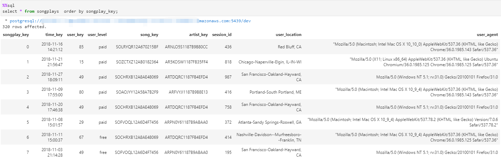

# Data Modeling for Song Play Analysis with Data Warehouse

The Project of Data Engineering Nanodegree Program on the Udacity

# Introduction

A music streaming startup, Sparkify, has grown their user base and song database and want to move their processes and data onto the cloud. Their data resides in S3, in a directory of JSON logs on user activity on the app, as well as a directory with JSON metadata on the songs in their app.

In this project, we'll use data warehouses and AWS to build an ETL pipeline for a database hosted on Redshift. To complete the project, we will load data from S3 to staging tables on Redshift and execute SQL statements that create the analytics tables from these staging tables.

# How to Run the Python Scripts

Enter the following command in the terminal：
1. 'python create_tables.py'
2. 'python etl.py'

# Project Datasets

## Song Dataset
Source: **s3://udacity-dend/song_data**

The first dataset is a subset of real data from the [Million Song Dataset](https://labrosa.ee.columbia.edu/millionsong/). Each file is in JSON format and contains metadata about a song and the artist of that song. The files are partitioned by the first three letters of each song's track ID. For example, here are filepaths to two files in this dataset.

*song_data/A/B/C/TRABCEI128F424C983.json*

*song_data/A/A/B/TRAABJL12903CDCF1A.json*

And below is an example of what a single song file, TRAABJL12903CDCF1A.json, looks like.

*{"num_songs": 1, "artist_id": "ARJIE2Y1187B994AB7", "artist_latitude": null, "artist_longitude": null, "artist_location": "", "artist_name": "Line Renaud", "song_id": "SOUPIRU12A6D4FA1E1", "title": "Der Kleine Dompfaff", "duration": 152.92036, "year": 0}*

## Log Dataset
Source: **s3://udacity-dend/log_data**

The second dataset consists of log files in JSON format generated by this [event simulator](https://github.com/Interana/eventsim) based on the songs in the dataset above. These simulate activity logs from a music streaming app based on specified configurations.
The log files in the dataset are partitioned by year and month. For example, here are filepaths to two files in this dataset.

*log_data/2018/11/2018-11-12-events.json*

*log_data/2018/11/2018-11-13-events.json*

And below is an example of what the data in a log file, 2018-11-12-events.json, looks like.

# Project Instructions
## Schema for Song Play Analysis
### Fact Table
 1. songplays - records in log data associated with song plays i.e. records with page **NextSong**
- *songplay_key, time_key, user_key, user_level, song_key, artist_key, session_id, user_location, user_agent*
### Dimension Tables
1. users - users in the app
  - *user_key, user_id, user_firstname, user_lastname, user_gender, user_level*
2. songs - songs in music database
  - *song_key, song_id, song_title, artist_id, song_year, song_duration*
3. artists - artists in music database
  - *artist_key, artist_id, artist_name, artist_location, artist_lattitude, artist_longitude*
4. time - timestamps of records in songplays broken down into specific units
  - *time_key, start_time, hour, day, week, month, year, weekday*

## Project Template
1.**create_table.py** is where you'll create your fact and dimension tables for the star schema in Redshift.

2.**etl.py** is where you'll load data from S3 into staging tables on Redshift and then process that data into your analytics tables on Redshift.

3.**sql_queries.py** is where you'll define you SQL statements, which will be imported into the two other files above.

4.**README.md** is where you'll provide discussion on your process and decisions for this ETL pipeline.

## Example
Queries and results of songplays table:

