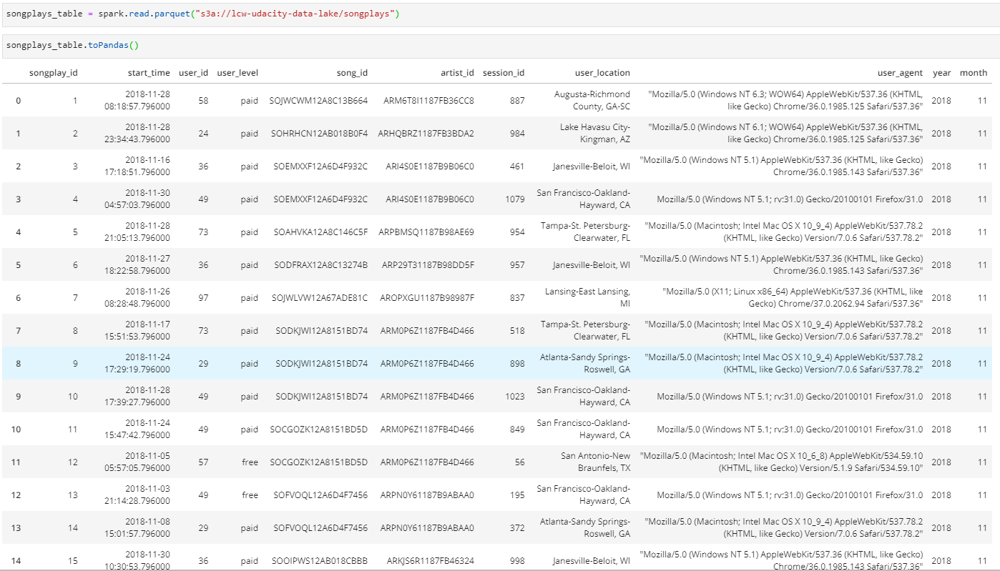

# Data Modeling for Song Play Analysis with Data Lake

The Project of Data Engineering Nanodegree Program on the Udacity

# Introduction

A music streaming startup, Sparkify, has grown their user base and song database even more and want to move their data warehouse to a data lake. Their data resides in S3, in a directory of JSON logs on user activity on the app, as well as a directory with JSON metadata on the songs in their app.

In this project, we'll build an ETL pipeline for a data lake hosted on S3, process the data into analytics tables using Spark, and load them back into S3 as a set of parquet files. This will allow their analytics team to continue finding insights in what songs their users are listening to.

# How to Run

Enter the following command in the terminal：

python etl.py

# How to Run in EMR Cluster
1.Connect to the EMR cluster via SSH

2.Upload dl.cfg (contains our AWS credentials) and etl.py to the EMR Cluster

3.Enter the following command:

spark-submit --master yarn ./etl.py

# Project Datasets

## Song Dataset
Source: **s3://udacity-dend/song_data**

The first dataset is a subset of real data from the [Million Song Dataset](https://labrosa.ee.columbia.edu/millionsong/). Each file is in JSON format and contains metadata about a song and the artist of that song. The files are partitioned by the first three letters of each song's track ID. For example, here are filepaths to two files in this dataset.

*song_data/A/B/C/TRABCEI128F424C983.json*

*song_data/A/A/B/TRAABJL12903CDCF1A.json*

And below is an example of what a single song file, TRAABJL12903CDCF1A.json, looks like.

*{"num_songs": 1, "artist_id": "ARJIE2Y1187B994AB7", "artist_latitude": null, "artist_longitude": null, "artist_location": "", "artist_name": "Line Renaud", "song_id": "SOUPIRU12A6D4FA1E1", "title": "Der Kleine Dompfaff", "duration": 152.92036, "year": 0}*

## Log Dataset
Source: **s3://udacity-dend/log_data**

The second dataset consists of log files in JSON format generated by this [event simulator](https://github.com/Interana/eventsim) based on the songs in the dataset above. These simulate activity logs from a music streaming app based on specified configurations.
The log files in the dataset are partitioned by year and month. For example, here are filepaths to two files in this dataset.

*log_data/2018/11/2018-11-12-events.json*

*log_data/2018/11/2018-11-13-events.json*

And below is an example of what the data in a log file, 2018-11-12-events.json, looks like.

# Project Instructions
## Schema for Song Play Analysis
### Fact Table
 1. songplays - records in log data associated with song plays i.e. records with page **NextSong**
- *songplay_id, start_time, user_id, level, song_id, artist_id, session_id, location, user_agent*
### Dimension Tables
1. users - users in the app
  - *user_id, first_name, last_name, gender, levell*
2. songs - songs in music database
  - *song_id, title, artist_id, year, duration*
3. artists - artists in music database
  - *artist_id, artist_name, artist_location, artist_lattitude, artist_longitude*
4. time - timestamps of records in songplays broken down into specific units
  - *start_time, hour, day, week, month, year, weekday*

## Project Files
1.**etl.py**  reads data from S3, processes that data using Spark, and writes them back to S3

2.**README.md** provides discussion on our process and decisions

## Example
Read the parquet files and result of songplays table:

