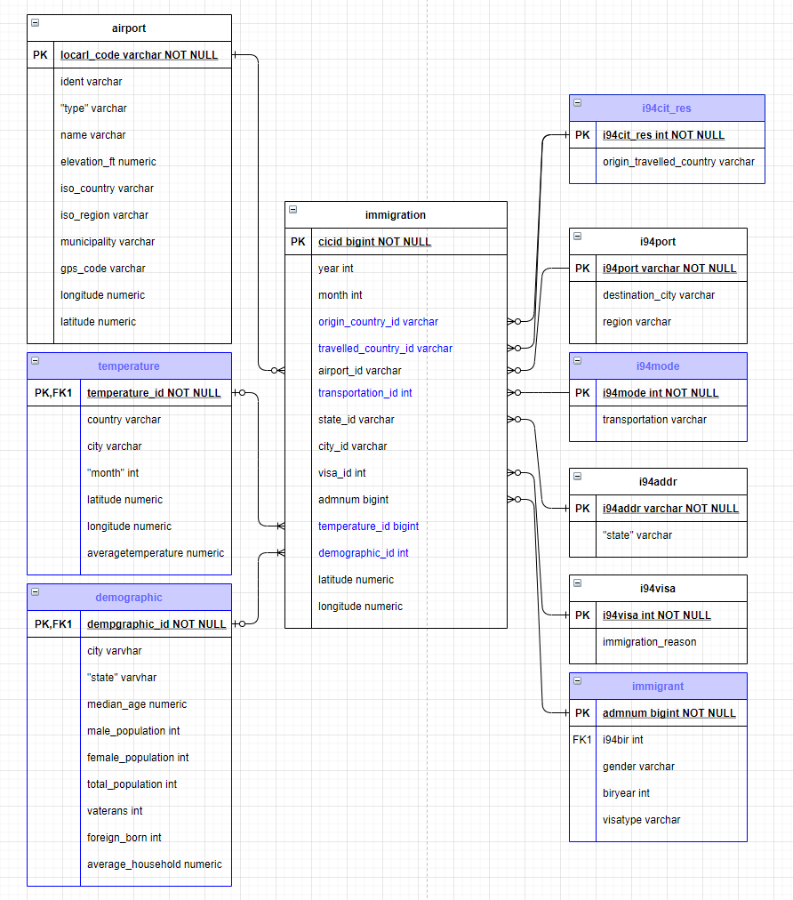
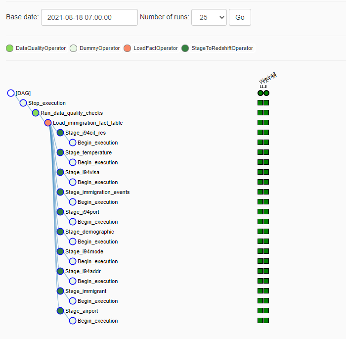

# Data Engineering Capstone Project

The Capstone Project of Data Engineering Nanodegree Program on the Udacity

# Introduction

The main dataset include data on immigration to the United States, and supplementary datasets will include data on airport codes, U.S. city demographics, and temperature data. We will use these data to build a model to explore the correlation between immigration data and USA cities.

# How to Run

- Enter the following command in the terminal：
1. 'python create_tables.py'
2. 'python etl.py' (we can run the commands to save the data in local machine,then upload to S3)
- Run airflow(this is on udacity workspace, local env has some wrong need to solve) to load data from S3 to RedShift, so the pipeline can be run on a daily basis by 7 am every day.
- Use immigration_analysis.ipynb to explore the data.

# Project Datasets

## I94 Immigration Data & Descriptions
This data comes from the US National Tourism and Trade Office. A data dictionary is included in the workspace. [This](https://www.trade.gov/national-travel-and-tourism-office) is where the data comes from. There's a sample file so you can take a look at the data in csv format before reading it all in. You do not have to use the entire dataset, just use what you need to accomplish the goal you set at the beginning of the project.

Some of files
Sample : *immigration_data_sample.csv*
Descriptions : *I94_SAS_Labels_Descriptions.SAS*

## World Temperature Data
This dataset came from Kaggle. You can read more about it [here](https://www.kaggle.com/berkeleyearth/climate-change-earth-surface-temperature-data).

File : *GlobalLandTemperaturesByCity.csv*

## U.S. City Demographic Data
This data comes from OpenSoft. You can read more about it [here](https://public.opendatasoft.com/explore/dataset/us-cities-demographics/export/).

File : *us-cities-demographics.csv*

## Airport Code Table
This is a simple table of airport codes and corresponding cities. It comes from [here](https://datahub.io/core/airport-codes#data).

File : *airport-codes_csv.csv*

# Project Instructions
## Schema for Immigration Analysis

- In this model, we don't consider the purple tables, like *i94cit_res, i94mode, temperature, demographic*.

- If we want to explore the relationship between temperature, urban population and immigration data, we can build another model.

### Fact Table
immigration - records with air transportation of immigrantion
- *cicid, year, month, airport_id, state_id, city, visa_id, admnum, longitude, latitude*

### Dimension Table
i94port - code of destination city

i94addr - is where the immigrants resides in USA 

i94visa - reason for immigration

airport - information of airports in USA

## Airflow - Grap View, Tree View

## Project Files
1.**create_tables.py** is where you'll create your fact and dimension tables for the star schema in Redshift.

2.**etl.py** is where you'll extract data from S3 or local machine, then transformed data into S3 or local machine, the load is in *airflow/*.

3.**sql_queries.py** is where you'll define your SQL statements, which will be imported into *create_table.py*.

4.**airflow/dags/dag.py** is load data from S3 to Redshift.

5.**airflow/plugins/helpers/sql_queries.py** provides a helper class that contains all the SQL transformations.

6.**airflow/plugins/operators/data_quality.py** is used to run checks on the data itself. The operator's main functionality is to receive one or more SQL based test cases along with the expected results and execute the tests. 

7.**airflow/plugins/operators/loac_fact.py** With fact operators, we can utilize the SQL helper(**helpers/sql_queries.py**) class to run data transformations.

8.**airflow/plugins/operators/stage_redshift.py** is able to load any JSON or PARQUET formatted files from S3 to Amazon Redshift. 

9.**ml_utils.py** is a machine learning class from github.

10.**immigration_analysis.ipynb** is a notebook of analysis.

11.**Capstone Project Template.ipynb** is a template of bullet points how to complete the project.

12.**README.md** provides discussion on our process and decisions.

